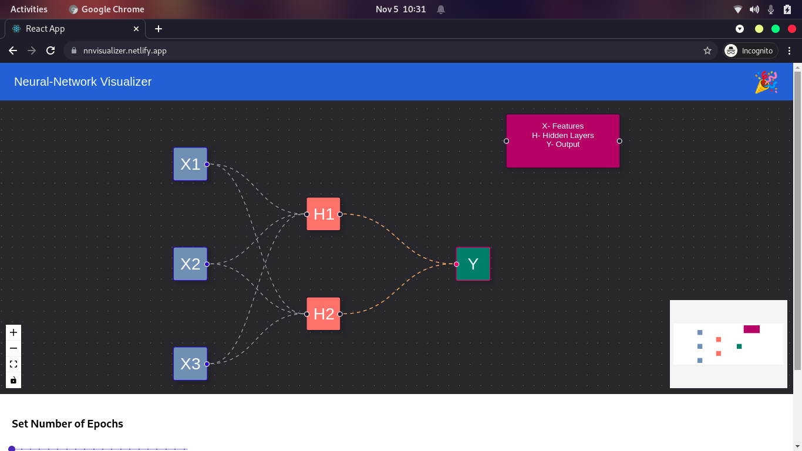
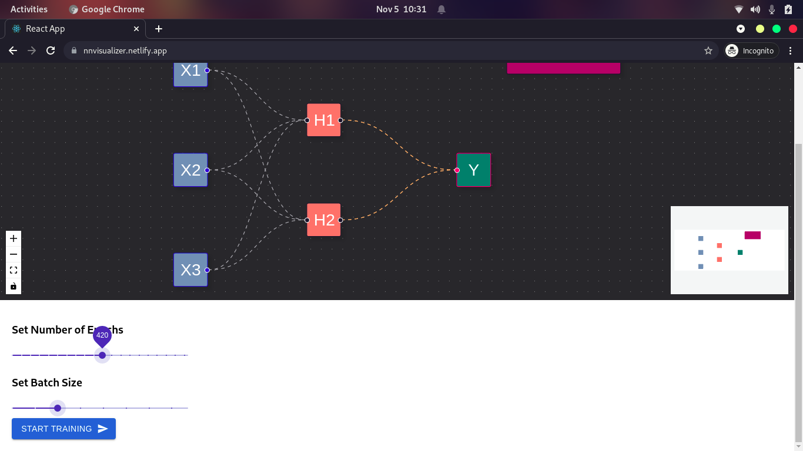
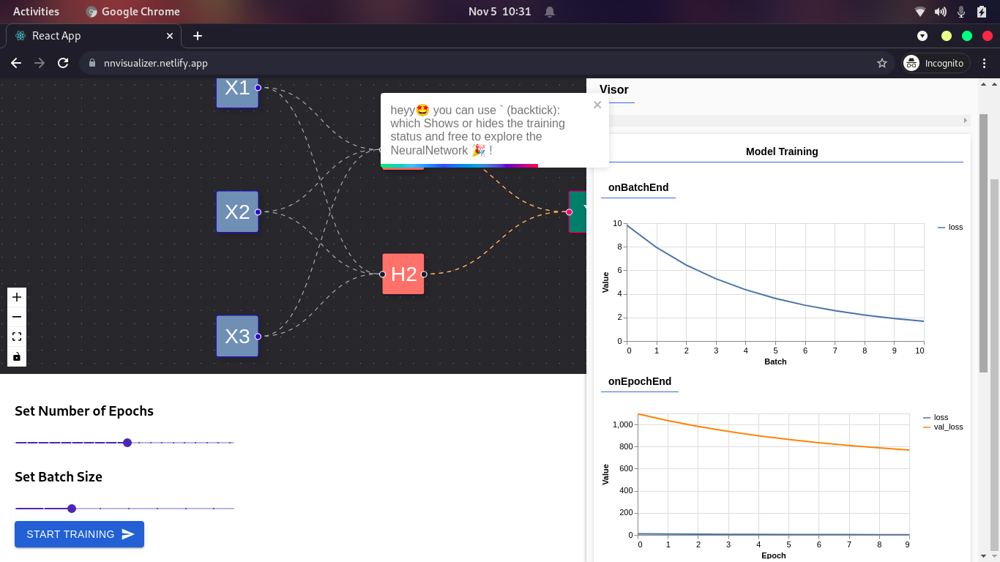

## Neural-Network Visulaizer

### Demo

Click on [https://nnvisualizer.netlify.app/](https://nnvisualizer.netlify.app/) to play with it.

In the project directory, you can run:

### `npm start`

Runs the app in the development mode.\
Open [http://localhost:3000](http://localhost:3000) to view it in the browser.

<h2><strong>Sample Design</strong></h2>
 
 

